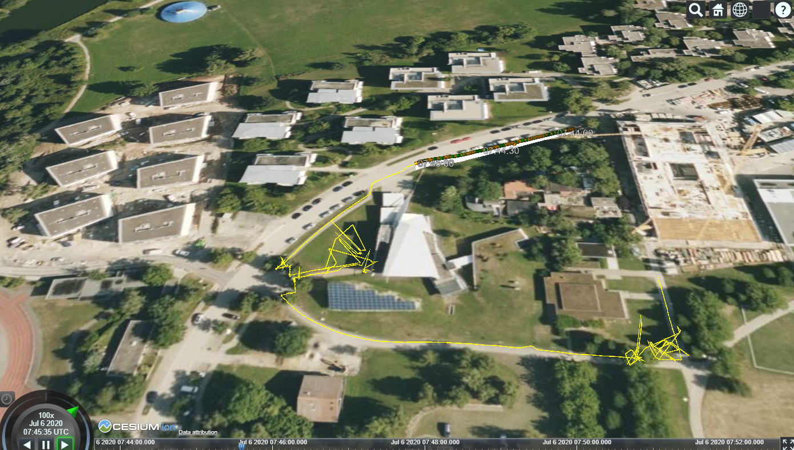

# Cesium Intro

This repository provides an introduction on how to use cesium and related technics for web-based presentation of geodata.

## Checkboxes

 [1-checkbox.html](https://github.com/pinguinonice/lab-visualisierung/blob/main/examples/1-checkbox.html) is a simple example on how to combine html and javascript to show and hide (i.e., toggle) primitives such as images.

## Cascading stylesheets

 [2-cascadingstylesheets.html](https://github.com/pinguinonice/lab-visualisierung/blob/main/examples/2-cascadingstylesheets.html) is a short example on how to use css files to make "checkbox.html" more pleasing to the eye.

change

## Cesium Hello World

 [3-cesium_helloworld.html ](https://github.com/pinguinonice/lab-visualisierung/blob/main/examples/3-cesium_helloworld.html) is a short example on how to display a point cloud hosted on the cesium ion server.

## Cesium radio buttons

 [4-cesiumradiobuttons.html  ](https://github.com/pinguinonice/lab-visualisierung/blob/main/examples/4-cesiumradiobuttons.html) is an example on how to display a point cloud, a mesh and an orthophoto hosted on the cesium ion server. We can use the check boxes to control visibility of each asset.

## Cesium time dynamic trajectory

 [5-cesium_time_dynamic_kml.html  ](https://github.com/pinguinonice/lab-visualisierung/blob/main/examples/5-cesium_time_dynamic_kml.html) is an example on how to display a time dynamic trajectory. For this, we firstly need to provide a proper .kml file (which can be the output of [5-txt2kml.py  ](https://github.com/pinguinonice/lab-visualisierung/blob/main/examples/5-txt2kml.py)) and upload it to cesium ion. The .kml is similar to this example https://developers.google.com/kml/documentation/time?csw=1. The visibility of the trajectory can be triggered with a checkbox.

 [5-cesium_time_dynamic_local_kml.html  ](https://github.com/pinguinonice/lab-visualisierung/blob/main/examples/5-cesium_time_dynamic_local_kml.html)  is the same example using a local file (requires localhosting, e.g. via XAMPP).

