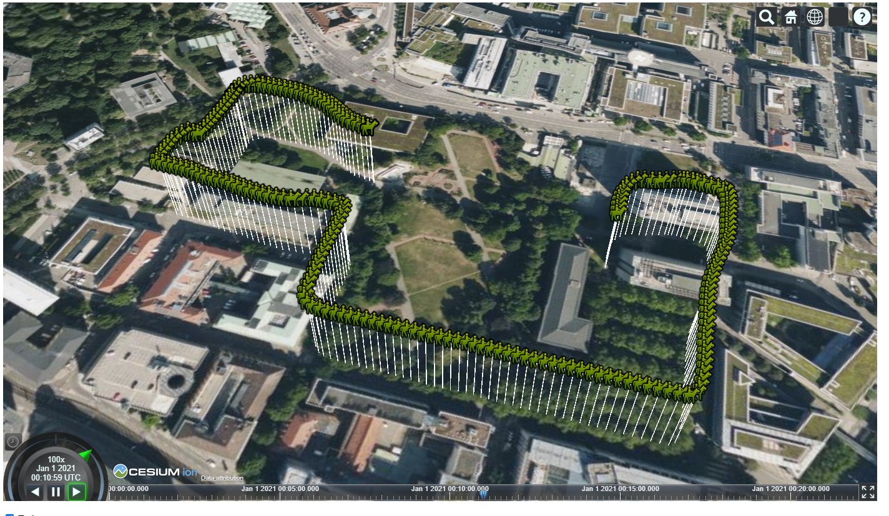

# Cesium Intro

The goal of this exercise is a short introduction to cesium.

In "examples" you find five files.

## checkbox

 [1-checkbox.html](https://github.com/pinguinonice/lab-visualisierung/blob/main/examples/1-checkbox.html) is an example how to use html and javascript to show and hide images

## cascading stylesheets

 [2-cascadingstylesheets.html](https://github.com/pinguinonice/lab-visualisierung/blob/main/examples/2-cascadingstylesheets.html)  is a short example how to use css to make "checkbox.html" more pleasing to the eye.

## Cesium Hello World

 [3-cesium_helloworld.html ](https://github.com/pinguinonice/lab-visualisierung/blob/main/examples/3-cesium_helloworld.html) is a short example how to display a pointcloud from the cesium ion server.

## cesium radio buttons

 [4-cesiumradiobuttons.html  ](https://github.com/pinguinonice/lab-visualisierung/blob/main/examples/4-cesiumradiobuttons.html) is an example how to display a pointcloud, a mesh and a orthophoto in from cesium ion. We can use the check boxes to toggle visibility of each asset.

## cesium Time Dynamic Trajectory

 [6-cesium_time_dynamic_kml.html  ](https://github.com/pinguinonice/lab-visualisierung/blob/main/examples/6-cesium_time_dynamic_kml.html) is an example how to display a time dynamic trajectory, originally a .kml  uploaded to cesium ion. The .kml is similar to this example https://developers.google.com/kml/documentation/time?csw=1.
 The visibility of the trajectory can be triggered with a checkbox.

 [6-cesium_time_dynamic_local_kml.html  ](https://github.com/pinguinonice/lab-visualisierung/blob/main/examples/6-cesium_time_dynamic_local_kml.html)  Is the same example on a local file (Requires i.e. XAMPP for localhost).

